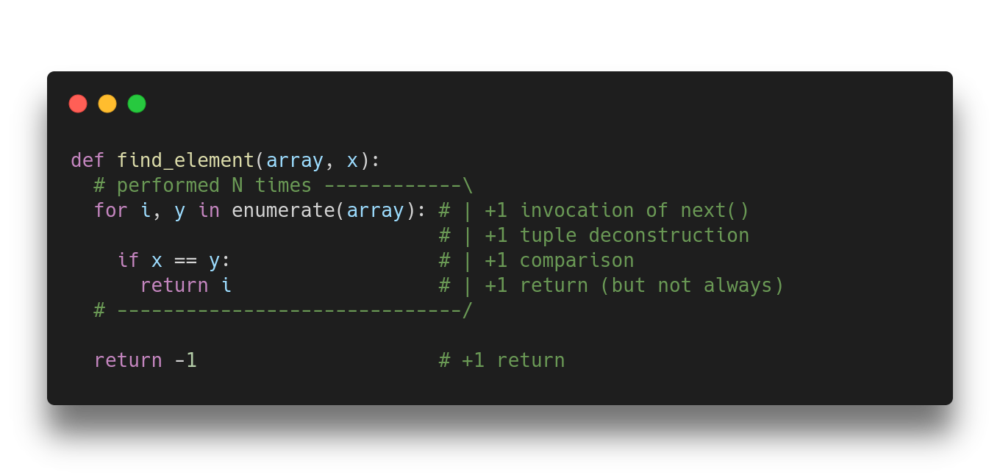

Hey, guess what, today is #TheoryThursday 🧐! 

A silly excuse I just invented to share with you random bits of theory from some dark corner of Computer Science and make it as beginner-friendly as possible 👇

---

Today I want to talk about *Complexity Theory*.

To get started, take a look at the following code. How long do you think it will take to run it? 

Let's make that question more precise. How long do you think it will take to run it in the worst-case scenario?  

<!--
```python
def find_element(array, x):
  for i, y in enumerate(array):
    if x == y:
      return i

  return -1
```
-->


---

We can see that the code will run slower if:

👉 your computer is older;
👉 the array is longer; or
👉 x happens to be further to back, or not present at all.

Can we turn these insights into an actual formula? We will have to get rid of ambiguous stuff like "old computers".

---

1️⃣ First, let's consider an abstract computer in which all "atomic" operations take exactly 1 unit of time. 

🤔 Defining exactly what is an "atomic" operation is far from trivial. For now, assume it's things like arithmetic operations, indexing, invocation.

---

2️⃣ Second, we'll count the number of operations *with respect to* the size of an arbitrary array.

We will say something like "this will cost 2 units of time for each element of the array".

---

3️⃣ Finally, we will consider the worst-case scenario.

So we assume, in this example, that the element x is not in the array. More generally, we will always think about the maximum number of operations that could potentially happen.

--- 

With these ideas in mind, we are ready to define the *Algorithm Complexity* of this algorithm. 

Let's count how many operations are performed in each step, assuming our array has length N:

<!-- 
```python
def find_element(array, x):
  # performed N times ------------\
  for i, y in enumerate(array): # | +1 invocation of next()
                                # | +1 tuple deconstruction
    if x == y:                  # | +1 comparison
      return i                  # | +1 return (but not always)
  # ------------------------------/

  return -1                     # +1 return
``` 
-->



--- 

Depending on how detailed you want to be counting, you could say we have something like 🔥3*N+1🔥 operations in the ultimate worst-case scenario.

❓ Now, why do we care about this? 

The reason is that we can now compare different algorithms. 

---

For example, if your implementation takes 🔥5*N+3🔥, then it is worse, right?

Well, it's not 😝

Here's the deal: we have been assuming that all "atomic" operations are equally costly, but this is not true...

---

Hence, it makes no sense to compare my implementation with your implementation by looking at those tiny differences. My 5 * N could be faster than your 3 * N if my "atomic" operations are simpler.

💡 We want a complexity measure that smooths away all implementation details.

---

To achieve this, we will take away everything unimportant when N becomes very large. We will consider that:

👉 N+a and N+b are the same;
👉 a*N and b*N are the same; 

... for any finite values a and b.

---

🔑 And instead of saying 3*N+4, we will say the asymptotic algorithmic complexity is O(N).

This is called big-O notation.

💡 We call this *linear complexity* because the number of operations grows linearly *with respect to* the size of the array.

---

🧐 Formally, it means that your function's cost is something that is bounded by a linear function.

💡 Intuitively, what this means is that in the long run, small differences like specific operations matter less than the capacity your algorithm has to *scale* with more data.

---

The reason is simple, an algorithm with a lower asymptotic complexity will eventually win. Take for example binary search.

https://en.wikipedia.org/wiki/Binary_search_algorithm

It takes a bit of thinking, but we can prove the asymptotic notation to be O(log N).

<!--
```python
def binary_search(array, x):
  left = 0
  right = len(array) - 1

  while left < right:
    m = (left + right) // 2
    
    if a[m] < x:
      left = m + 1
    elif a[m] > x:
      right = m - 1
    else:
      return m

  return -1
```
-->


---

Binary search is doing much more work in each iteration than linear search. It could be 20 * log N vs 3 * N. Hence, with very small arrays, linear search could be better.

🔑 But there is always a value of N after which binary search will win, and in any hardware.

---

❤️ And that's it. We have just arrived at the intuitive notion of asymptotic complexity!

Calculating it can be daunting for some non-trivial algorithms, but here are some tips for estimating it:

---

1️⃣ Every nested for loop from beginning to end usually means another exponent.

For example, two nested loops usually mean O(N^2), three nested loops, O(N^3), and four nested loops means you really need to take a break and, afterward, please refactor that code.

---

2️⃣ An invocation to function F inside a loop means you have to multiply N times the complexity of F.

For example, if we call binary search for each element of the array, the resulting algorithm is O(N log N)

---

3️⃣ In recursive methods, if you split at the middle and recurse down only one branch, that's O(log N). If you recurse down both branches, you usually have O(N log N).

These are special cases of a more general rule for recursive methods:

https://en.wikipedia.org/wiki/Master_theorem_(analysis_of_algorithms)

---

Finally, we have just scratched the surface in this thread. Algorithmic complexity is a fascinating topic that touches all fields in Computer Science.

The most important problem in all of CS comes from here, the infamous 🔥P vs NP🔥.

But that's a story for another Thursday 😉.

---
